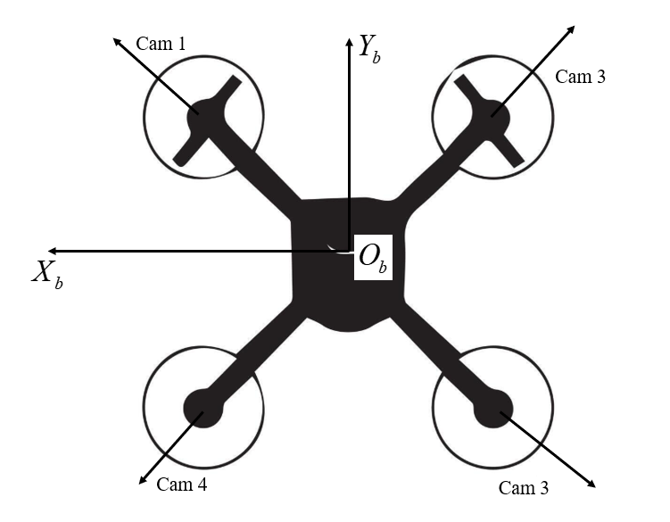

# RflySim坐标系说明
* Rflysim3D: NED
* CopterSim: NEU -> 左手系
* 载体系: NED
* 地面系：x位于水平面内指向固定方向（如飞机航线方向），z垂直地平面向下，原点在地面上某一点
* 机体系：x沿纵轴指向前，z向下为正
* 气流坐标系：x指向飞机相对气流的速度矢量方向，z在飞机纵向平面内指向下
* IMU坐标系: FLU (前左上)
* 相机系: UWN（北天西， 这样定有什么用，相机系还跟外参有关，描述相机相对于本体系以UWN来算？？->某一个文档写的）。
* **json中描述相机姿态的相机系：跟机体系相同，x垂直相机成像平面，z朝下**，同样需要注意json中欧拉角的单位为**度**。
* LiDAR系：FLU

# 项目组织结构说明
1. 数据集 -> dataset -> train/test -> scene -> trajectory -> imgs, labels, cam_infos
2. `./getRflysimData.py` -> 用于获取Rflysim数据集
3. `./config/Config.json` -> 配置RflySim中的相机

# 数据说明
1. `label_{时间戳}.txt`: `timestamp, x, y, z, vx, vy, vz, roll(rad), pitch(rad), yaw(rad), wx, wy, wz (data of PX4)`
2. `cam_infos.txt`: 每一行代表一个相机，格式为 -> `mapping_coeffients_i(4x1), ImageSize_i(2x1), Distortion_Center_i(2x1), StretchMatrix_i(4x1), roll_i(deg), pitch_i(deg), yaw_i(deg), tx_i(m), ty_i(m), tz_i(m)` -> 这里四个相机，i取值为0到3；位姿是相机系相对于机体系
3. 图像：`imgs_{相机序号}_{时间戳}.jpg`
4. 鱼眼相机的布置：相互之间90°夹角位于机体系XoY平面上。具体布置可参考 [OmniNxt](https://ieeexplore.ieee.org/document/10802134)，示意图：
4. 鱼眼相机内参的标定：目前在场景中放置标定板采集->标定板角点8×11，边长为6cm -> 直接把相机标定例程中的相机换为相同参数的鱼眼做的
5. 其他：采集频率20Hz，飞行高度15m

# 场景说明
1. `scene001`: DesertTown, Rflysim默认场景
2. `scene002`: OldFactory, Rflysim默认场景   动态的车
3. `scene003`: Grasslands, Rflysim默认场景
2. `scene004`: WinterTown, 对角线两个端点(-500m, -500m)和(500m, 500m)， 山坡最大高度一百多米
3. `scene005`: IceRoad, 对角线两个端点(-1500m,-5400m)和(5000m, 3000m)， 山坡最大高度500m
4. `scene006`: Desert，, 对角线两个端点(-6000m,-8000m)和(7000m, 7000m)， 山坡最大高度500m
5. `scene007`: DowntownWest，, 对角线两个端点(-800m,-800m)和(900m, 1000m)， 山坡最大高度100m
2. `scene008`: Forest, 对角线两个端点(-2160m,0m)和(-2160m, 0m)， 山坡最大高度100m
5. `scene009`: OldWestLearning, 对角线两个端点(-600m,-900m)(1000m,900m), 最大高度100m
3. `scene010`: Island,  对角线两个端点(-700m,-900m)(700m,900m), 最大高度100m
3. `scene011`: MountainRange,  对角线两个端点(-4000m,-4000m)(4000m,4000m), 最大高度400m
3. `scene012`: City, 对角线两个端点(-2000m,-2500m)(3000m,3000m), 最大高度300m

# 使用方法
1. 在`./config/Config.json`中配置相机参数
2. 在`./config/scenexxx.bat`中配置场景参数
3. 在`./getRflysimData.py`中设置好场景编号`ind_scene`和轨迹编号`ind_traj`后运行，此时RflySim会启动。此后，在QGC中设置航点控制四旋翼的运动，此时Python脚本会记录数据。最后对记录下来的图片和label进行修正。

# Reference
- [视觉接口实验](https://rflysim.com/doc/zh/RflySimAPIs/8.RflySimVision/0.ApiExps/1-UsageAPI/Readme.pdf)
- [RflySimVision：视觉感知与避障决策例程检索文件](https://rflysim.com/doc/zh/RflySimAPIs/8.RflySimVision/Index.pdf)
- [视觉感知与避障决策视频教程](https://rflysim.com/doc/zh/8/Intro.html)
- [RflySimVision API 文档](https://rflysim.com/doc/zh/RflySimAPIs/8.RflySimVision/API.pdf)
- 安装路径下的视觉例程
- [基于平台地形服务的地形点云高程读取实验](https://rflysim.com/doc/zh/RflySimAPIs/3.RflySim3DUE/1.BasicExps/e3_RflySim3DTerrainPcd/Readme.pdf)
- [部分坐标系](https://rflysim.com/doc/zh/RflySimAPIs/4.RflySimModel/2.AdvExps/e4_VTOLModelCtrl/2.TailsitterModelCtrl/Readme.pdf)