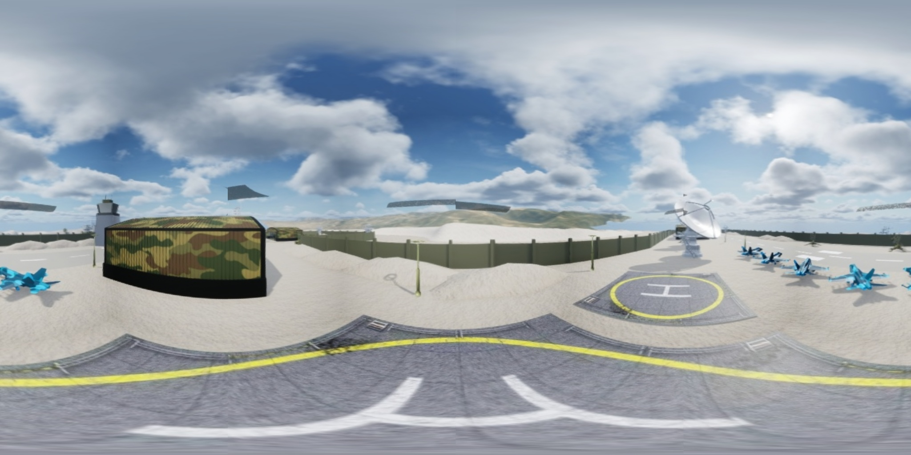

# RflyPano: A Virtual UAV Localization Panoramic Dataset from RflySim

This repository provides:

- Panoramic datasets and fisheye datasets for UAV global localization.
- A Python script to stitch four fisheye camera images into a seamless panoramic image based on polynomial fisheye distortion modeling and equirectangular projection from RflySim.
- Scripts to collect fisheye datasets from RflySim.

The dataset and images are generated from a virtual environment using **RflySim (version 3.07 full edition)**.

📘 You can find detailed documentation for RflySim at:  
👉 https://rflysim.com/doc/en/

Below is an example of the stitched panoramic image from four fisheye inputs:

Feel free to explore and have fun!

---

## 📁 Dataset Structure

The dataset is organized hierarchically and consists of two main folders:

---

### 🔹 `FisheyeView/sceneXX/seqXX/` – Input fisheye images and extrinsics

🕜🔹 `img_0_<timestamp>.jpg`   — Front-Right camera  
🕜🔹 `img_1_<timestamp>.jpg`   — Rear-Right camera  
🕜🔹 `img_2_<timestamp>.jpg`   — Rear-Left camera  
🕜🔹 `img_3_<timestamp>.jpg`   — Front-Left camera  
🕜📄 `label_<timestamp>.txt`   — Extrinsic parameters for this timestamp (e.g., relative camera poses)

Each `seqXX` contains multiple image groups. A valid group consists of:
- Four images with the same `<timestamp>`
- One `label_<timestamp>.txt` describing extrinsics

Details can be found [here](./PanoramaDataset/readme.md)

---

### 🔹 `PanoramaView/sceneXX/seqXX/` – Output panoramic image and calibration info

🕜🔹 `panorama_<timestamp>.jpg` — Stitched panoramic image for one timestamp  
🕜📄 `cam_infos.txt` — Camera parameters and poses for all four cameras in this scene

The file `cam_infos.txt` includes 4 lines (one per camera, `i = 0 to 3`), each with the following format:

mapping_coeffs_i (4), ImageSize_i (2), DistortionCenter_i (2), StretchMatrix_i (4), roll_i, pitch_i, yaw_i (degrees), tx_i, ty_i, tz_i (meters)

This describes both the **intrinsic** and **extrinsic** calibration of each fisheye camera:

- `mapping_coeffs`: Polynomial coefficients of the fisheye projection model
- `ImageSize`: Image resolution (width, height)
- `DistortionCenter`: Optical center of the fisheye image
- `StretchMatrix`: Calibration scaling (typically 2x2 matrix, stored row-wise)
- `roll/pitch/yaw`: Orientation of the camera relative to the UAV body frame (in degrees)
- `tx/ty/tz`: Translation of the camera in meters (also relative to UAV body frame)

> 🧭 These parameters ensure accurate projection and spatial alignment during panoramic stitching.

---

### 📌 File Naming Convention

img_<camera_id><timestamp>.jpg label<timestamp>.txt panorama_<timestamp>.jpg

- `camera_id`: 0 = front-right, 1 = rear-right, 2 = rear-left, 3 = front-left  
- `timestamp`: Floating-point number with up to 6 decimal places (e.g., `1713947554.840796`)

> The script will recursively process all `sceneXX/seqXX/` folders and output the results with matching structure and filenames.

📜 Files

`fisheye_to_panorama.py` – Main script for stitching four fisheye images into a panoramic image

`fisheye_intrinsics.txt` – Intrinsic parameters of the fisheye camera in polynomial form

`PanoramaDataset` - Folder containing scripts for dataset collection. Details can be found [here](./PanoramaDataset/readme.md)

🔧 Camera Model

The fisheye model used is based on a 4th-degree polynomial mapping from viewing angle (theta) to image radius:

r(theta) = k0 * theta + k1 * theta^3 + k2 * theta^5 + k3 * theta^7

🚀 Usage

Run the script:

`python fisheye_to_panorama.py --input_dir FisheyeView --output_dir PanoramaView`

The script will automatically:

Group fisheye images by timestamp

Perform angular reprojection and undistortion

Generate and save panoramic images

📌 Notes

Ensure each timestamp has exactly four images and follow the naming conventions, one from each direction.

The script supports batch processing and robust interpolation.

You can adjust panorama resolution via the `--pano_size parameter` in the script.

📦 A small demo dataset is available for downloading via Google Drive:

👉 [Download demo panorama dataset (Google Drive)](https://drive.google.com/file/d/1tduZfmEj0t1jUEV401Rd64Ank1QgVlm-/view?usp=sharing)

👉 [Download demo fisheye dataset (Google Drive)](https://drive.google.com/file/d/1mcBSOLBNlwCNWw0UPQaiEn11kdygkzYD/view?usp=sharing)

This demo includes:
- Raw fisheye images from four virtual cameras (`FisheyeView/sceneXX/seqXX/`)
- Corresponding extrinsic parameters (`label_<timestamp>.txt`)
- Precomputed panoramic images (`PanoramaView/sceneXX/seqXX/`)
- Camera configuration info for each sequence (`cam_infos.txt`)

You can use this dataset to directly test the stitching script or to verify results with the pre-generated panoramas.

## ⚠️  Acknowledgements
1. Scene001 ~ Scene003 of the dataset are default scenes in RflySim.
2. Other scenes are downloaded and cooked from [FAB](https://www.fab.com/zh-cn).